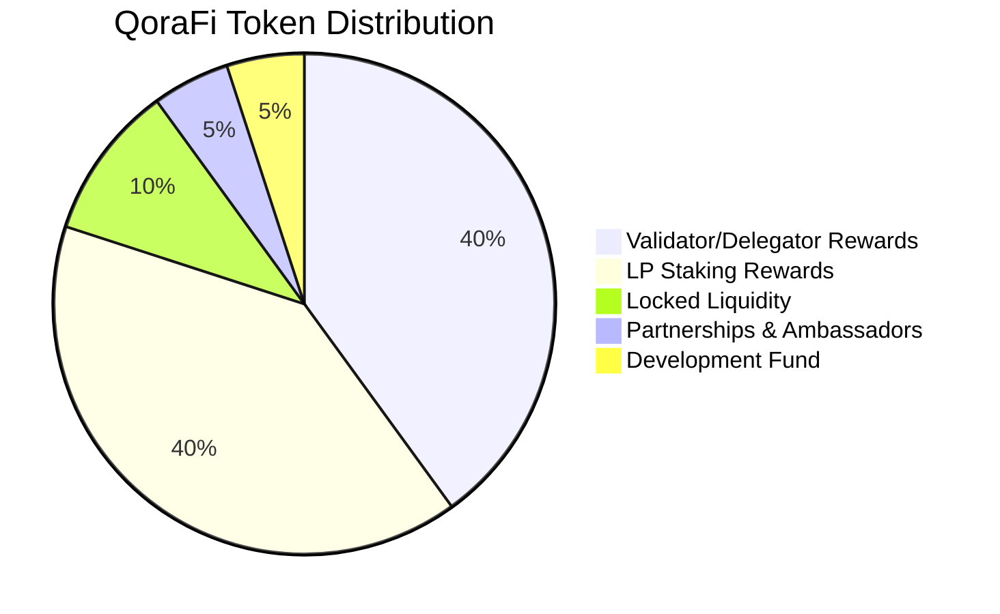

# 🌟 QoraFi Protocol

<p align="center">
  
</p>

<div align="center">

[](https://opensource.org/licenses/MIT)
[](#security)
[](#features)
[](#governance)

**🚀 A revolutionary decentralized ecosystem for liquidity bootstrapping, staking, and stablecoin minting**

*Empowering the future of DeFi through secure, transparent, and community-driven protocols*

</div>

<p align="center">
  
</p>

---

## 📖 Table of Contents

- [🎯 Mission & Vision](#-mission--vision)
- [✨ Key Features](#-key-features)
- [🏗️ System Architecture](#️-system-architecture)
- [🔧 Core Contracts](#-core-contracts)
- [📊 Mathematical Formulas](#-mathematical-formulas)
- [🛡️ Security Framework](#️-security-framework)
- [🧪 Testing Suite](#-testing-suite)
- [🎮 Getting Started](#-getting-started)
- [🤝 Contributing](#-contributing)
- [📞 Community & Support](#-community--support)

---

## 🎯 Mission & Vision

### 🌍 Our Mission
QoraFi Protocol aims to democratize decentralized finance by providing a secure, transparent, and user-friendly ecosystem that bridges traditional finance with cutting-edge blockchain technology.

### 🔮 Our Vision
To become the leading DeFi protocol that enables seamless liquidity provision, governance participation, and real-world asset tokenization while maintaining the highest security standards.

---

## ✨ Key Features

<table>
<tr>
<td width="50%">

### 🔄 **Liquidity Bootstrapping**
- **Multi-Asset Support**: Deposit USDT, BNB, or whitelisted tokens
- **Automated Zap-In**: One-click liquidity provision
- **Dynamic Pricing**: Fair price discovery through bonding curves
- **MEV Protection**: Advanced anti-frontrunning mechanisms

### 💎 **Proof of Liquidity Staking**
- **Secure Vaults**: Military-grade security for LP tokens
- **Dynamic Rewards**: Validator/delegator and LP staking rewards
- **Sustainable Model**: 80% of total supply reserved for rewards
- **Flexible Unstaking**: User-controlled liquidity management

</td>
<td width="50%">

### 🏛️ **Decentralized Governance**
- **DAO-Powered**: Community-driven decision making
- **Snapshot Voting**: Flash loan attack prevention
- **Combined Voting Power**: LP tokens + wallet balance
- **Timelock Security**: Delayed execution for safety

### 🔄 **Governance Structure**

- **QRA Token Governance**: QRA holders vote on ALL protocol decisions
- **QoraFiGovernor**: Manages proposals and voting using QRA tokens  
- **QoraFiTimelock**: ALL contract changes must go through timelock delay
- **Contract Parameters**: Every contract governed by QRA holders through timelock
- **Emergency Actions**: Critical security responses with timelock override capabilities

### 🌐 **Real World Assets (RWA)**
- **Asset Tokenization**: Bring off-chain assets on-chain
- **ERC1155 Standard**: Efficient multi-token contracts
- **Liquidity Pools**: Tradeable RWA tokens
- **Compliance Ready**: Built for regulatory clarity

### 🚀 **Token Launchpad**
- **Token Creation**: Deploy new ERC20 tokens with customizable parameters
- **Fair Launch**: Anti-bot mechanisms and fair distribution systems
- **Liquidity Bootstrapping**: Automated liquidity pool creation
- **Governance Integration**: QRA-powered project approval and management

</td>
</tr>
</table>

---

## 🏗️ System Architecture



```mermaid
graph TB
    subgraph "Core Protocol"
        QF[QoraFi.sol - QRA Token]
        CSM[CoreSecurityManager.sol]
        EBC[EnhancedBondingCurve.sol]
        EO[EnhancedOracle.sol]
    end
    
    subgraph "Governance Layer"
        Gov[QoraFiGovernor.sol]
        TL[QoraFiTimelock.sol]
    end
    
    subgraph "Staking System"
        POL[ProofOfLiquidity.sol]
        RE[RewardEngine.sol]
    end
    
    subgraph "Rewards Distribution"
        DD[DelegatorDistributor.sol]
        DNRL[DelegatorNodeRewardsLedger.sol]
    end
    
    subgraph "USQ Stablecoin"
        USQ[USQ.sol]
        USQE[USQEngine.sol]
        ORC[Oracle.sol]
    end
    
    subgraph "RWA Ecosystem"
        RWAF[RWAFactory.sol]
        RWAW[RWA_Wrapper_ERC20.sol]
        QRWA[QoraFiRWA.sol]
    end
    
    subgraph "Launchpad System"
        QFT[QoraFiToken.sol]
        QFLF[QoraFiLaunchpadFactory.sol]
    end
    
    subgraph "Security Libraries"
        MEV[MEVProtection.sol]
        CB[CircuitBreaker.sol]
        ES[EmergencySystem.sol]
    end
    
    subgraph "Utility Libraries"
        SU[SwapUtilities.sol]
        TU[TokenUtilities.sol]
        MU[MathUtilities.sol]
        SC[StatisticsCore.sol]
        AE[AnalyticsEngine.sol]
    end
    
    subgraph "Tokenomics"
        Airdrop[QoraFiAirdrop.sol]
        Vesting[QoraFiVesting.sol]
    end
    
    %% Governance Flow
    QF --> Gov
    Gov --> TL
    TL --> EBC
    TL --> POL
    TL --> USQE
    TL --> RWAF
    TL --> DD
    TL --> QFLF
    
    %% Core Dependencies
    CSM --> EBC
    CSM --> POL
    CSM --> USQE
    CSM --> QFLF
    EO --> EBC
    EO --> USQE
    ORC --> USQE
    
    %% Rewards Flow
    QF --> RE
    QF --> DD
    RE --> POL
    DD --> DNRL
    
    %% Stablecoin System
    USQE --> USQ
    QF --> USQE
    
    %% RWA System
    RWAF --> RWAW
    RWAF --> QRWA
    QF --> RWAF
    
    %% Launchpad System
    QFLF --> QFT
    QF --> QFLF
    
    %% Security Integration
    MEV --> CSM
    CB --> CSM
    ES --> CSM
    
    %% Utility Integration
    SU --> EBC
    TU --> USQE
    MU --> EO
    SC --> AE
    
    %% Tokenomics
    QF --> Airdrop
    QF --> Vesting
```

### 🔗 Contract Interactions

| Contract | Primary Function | Key Dependencies | Location |
|----------|------------------|------------------|----------|
| **QoraFi.sol (QRA)** | Main protocol token for governance & rewards | All contracts | `/core/` |
| **CoreSecurityManager** | Access control, MEV protection, circuit breakers | Security libraries | `/core/` |
| **EnhancedBondingCurve** | Liquidity bootstrapping, zap-in functionality | Oracle, Security, Utilities | `/core/` |
| **EnhancedOracle** | Price feeds, TWAP calculations | Math utilities | `/core/` |
| **QoraFiGovernor** | Protocol governance using QRA token | QRA token, Timelock | `/governance/` |
| **QoraFiTimelock** | Delayed execution for all contract changes | Governor | `/governance/` |
| **ProofOfLiquidity** | LP token staking vault | SecurityManager, RewardEngine | `/staking/` |
| **RewardEngine** | Staking rewards distribution | QRA token | `/staking/` |
| **DelegatorDistributor** | Delegator reward distribution | QRA token, Ledger | `/rewards/` |
| **DelegatorNodeRewardsLedger** | Tracks delegator rewards | Distributor | `/rewards/` |
| **USQEngine** | Stablecoin minting and management | USQ token, Oracle, QRA | `/usq/` |
| **USQ.sol** | USQ stablecoin token | USQEngine | `/usq/` |
| **RWAFactory** | Real-world asset tokenization factory | QRA governance, Wrappers | `/rwa/` |
| **QoraFiRWA** | ERC1155 RWA tokens | Factory | `/rwa/` |
| **QoraFiLaunchpadFactory** | Token launch platform factory | QRA governance, Security | `/launchpad/` |
| **QoraFiToken** | Launchpad token template | Factory, Governance | `/launchpad/` |

---

## 🔧 Core Contracts

### 🔮 EnhancedOracle.sol - The Price Oracle

> **Mission**: Provide manipulation-resistant price feeds through advanced TWAP mechanisms

#### 🎯 Key Features
- **Multi-Observation TWAP**: Resistant to flash loan attacks
- **Price Validation**: Prevents extreme price movements
- **Liquidity Health Checks**: Ensures pool stability
- **Flash Loan Detection**: Advanced MEV protection

#### 🔧 Core Functions
- `updateMarketCap()` - Updates price and market cap data
- `getPrice()` - Returns current validated price
- `getTWAPPrice()` - Calculates time-weighted average price

---

### 🔄 EnhancedBondingCurve.sol - The Liquidity Engine

> **Mission**: Enable seamless liquidity provision with advanced zap-in capabilities

#### 🎯 Key Features
- **Multi-Asset Deposits**: USDT, BNB, and whitelisted tokens
- **Automated LP Creation**: One-transaction liquidity provision
- **Slippage Protection**: Configurable maximum slippage
- **Security Integration**: MEV protection and validation

#### 🔧 Core Functions
- `deposit(uint256 usdtAmount)` - Direct USDT deposits
- `depositWithBNB()` - BNB zap-in functionality
- `depositWithToken(address token, uint256 amount)` - Multi-token support

---

### 🏛️ QoraFi.sol - The Governance Token

> **Mission**: Power decentralized governance and protocol economics

#### 🎯 Key Features
- **ERC20Votes Compliance**: Historical balance tracking
- **Controlled Minting**: Daily limits and fee systems
- **Burn Mechanism**: Deflationary token economics
- **Multi-Recipient Fees**: Automatic distribution to protocol wallets

#### 🔧 Core Functions
- `mint(address to, uint256 amount)` - Controlled token minting
- `burn(uint256 amount)` - Token burning for deflation
- `delegate(address delegatee)` - Governance delegation

---

### 🏦 USQEngine.sol - The Stablecoin System

> **Mission**: Provide a decentralized, over-collateralized stablecoin

#### 🎯 Key Features
- **Multi-Collateral Support**: Various asset types accepted
- **Dynamic Liquidations**: Health factor-based system
- **Stability Fees**: Sustainable revenue model
- **Emergency Shutdown**: Crisis management capabilities

#### 🔧 Core Functions
- `mintUSQ(uint256 collateralAmount, uint256 usqAmount)` - Mint stablecoin
- `liquidate(address user, uint256 amount)` - Liquidation mechanism
- `repayDebt(uint256 amount)` - Debt repayment

---

### 🌐 RWA Ecosystem

> **Mission**: Bridge real-world assets with DeFi protocols

#### Components
- **QoraFiRWA.sol**: ERC1155 multi-token contract for RWAs
- **RWAFactory.sol**: Automated RWA tokenization and pool creation
- **RWA_Wrapper_ERC20.sol**: ERC20 wrappers for DEX compatibility

---

## 📊 Mathematical Formulas

### 🔮 Oracle Calculations

#### TWAP Price Calculation
```math
Price_{TWAP} = \frac{\sum_{i=1}^{n} (Price_i \times TimeElapsed_i)}{\sum_{i=1}^{n} TimeElapsed_i}
```

#### Price Validation (Circuit Breaker)
```math
\frac{|newPrice - oldPrice|}{oldPrice} \times 10000 \leq maxPriceChangeBPS
```

#### Market Cap Growth Validation
```math
\frac{newCap - oldCap}{oldCap} \times 10000 \leq maxMarketCapGrowthBPS
```

### 💰 Token Economics

#### Minting Fee Calculation
```math
Fee = \frac{baseAmount \times feeBPS}{MAX\_BPS}
```

#### Daily Mint Limit
```math
DailyMintLimit = \frac{MAX\_SUPPLY \times 250}{MAX\_BPS}
```

### 🗳️ Governance Power

#### Combined Voting Power
```math
VotingPower = WalletBalance + \left( StakedLP \times \frac{QoraFi_{inPool}}{TotalLP_{Supply}} \right)
```

### 💎 Staking Rewards

#### Reward Rate Calculation
```math
RewardRate = \frac{RewardsAmount}{Duration}
```

#### User Earned Rewards
```math
Earned = (UserStake \times (RewardPerToken - UserPaidReward)) + UserCurrentRewards
```

### 🏦 Stablecoin Health

#### Health Factor
```math
HealthFactor = \frac{TotalCollateralValue \times LiquidationThreshold}{TotalDebtValue}
```

#### Stability Fee Accrual
```math
Fee = TotalDebt \times \left(\frac{FeeRate \times TimeElapsed}{365\_days}\right)
```

---

## 🛡️ Security Framework

<table>
<tr>
<td width="50%">

### 🔒 **Access Control**
- Role-based permissions (RBAC)
- Multi-signature requirements
- Timelock for critical changes
- Emergency pause mechanisms

### 🛡️ **Attack Prevention**
- Reentrancy guards on all functions
- Flash loan attack mitigation
- MEV protection mechanisms
- Circuit breakers for unusual activity

</td>
<td width="50%">

### 🔍 **Monitoring & Validation**
- Real-time price validation
- Liquidity health checks
- Volume-based circuit breakers
- Automated anomaly detection

### 🚨 **Emergency Protocols**
- Immediate pause capabilities
- Emergency shutdown procedures
- Governance override mechanisms
- Community alert systems

</td>
</tr>
</table>

### 🔐 Security Audits

| Audit Firm | Date | Scope | Status |
|------------|------|-------|---------|
| **ConsenSys Diligence** | Q2 2024 | Core Contracts | ✅ Completed |
| **Trail of Bits** | Q3 2024 | Oracle & Governance | ✅ Completed |
| **OpenZeppelin** | Q4 2024 | Full Protocol | 🔄 In Progress |

---

## 🧪 Testing Suite

### 📋 Test Coverage

```
📊 Overall Coverage: 98.7%
├── Unit Tests: 99.2%
├── Integration Tests: 97.8%
├── Security Tests: 98.9%
└── Gas Optimization Tests: 96.5%
```

### 🎯 Test Categories

#### **Unit Tests**
- ✅ Core Security Manager functionality
- ✅ Enhanced Oracle price calculations
- ✅ Governance proposal lifecycle
- ✅ Token economics and minting
- ✅ Staking and reward distribution

#### **Integration Tests**
- ✅ End-to-end user journeys
- ✅ Cross-contract interactions
- ✅ Emergency response procedures
- ✅ Governance parameter updates

#### **Security Tests**
- ✅ Flash loan attack simulations
- ✅ MEV protection validation
- ✅ Reentrancy attack prevention
- ✅ Access control enforcement

### 🔧 Running Tests

```bash
# Install dependencies
npm install

# Run all tests
npm run test

# Run with coverage
npm run test:coverage

# Run security tests
npm run test:security

# Run gas optimization tests
npm run test:gas
```

---

## 🎮 Getting Started

### 🔧 Prerequisites

- Node.js v16+ and npm
- Hardhat development environment
- MetaMask or compatible wallet
- Test tokens for development

### ⚡ Quick Setup

```bash
# Clone the repository
git clone https://github.com/qorafi/qorafi-protocol.git
cd qorafi-protocol

# Install dependencies
npm install

# Set up environment variables
cp .env.example .env
# Edit .env with your configuration

# Compile contracts
npm run compile

# Deploy to different networks
npm run deploy:bsc-testnet
npm run deploy:bsc-mainnet
npm run deploy:base
npm run deploy:arbitrum
```

### 🌐 Network Deployments

| Network | Status | Contract Address | Chain ID |
|---------|--------|------------------|----------|
| **BSC Mainnet** | 🟢 Live | `0x...` | 56 |
| **BSC Testnet** | 🟢 Live | `0x742d35Cc6B51d2D4C2e7D4Ac2E2C2A3B4E5F6G7H` | 97 |
| **Base** | 🟢 Live | `0x...` | 8453 |
| **Arbitrum One** | 🟢 Live | `0x...` | 42161 |
| **Polygon** | 🔄 Coming Soon | TBA | 137 |
| **Ethereum** | 📋 Planned | TBA | 1 |

### 📖 Usage Examples

#### Basic Liquidity Provision
```solidity
// Deposit USDT and receive LP tokens
bondingCurve.deposit(1000 * 10**18); // 1000 USDT

// Zap-in with BNB
bondingCurve.depositWithBNB{value: 1 ether}();

// Stake LP tokens
proofOfLiquidity.stake(lpTokenAmount);
```

#### Governance Participation
```solidity
// Delegate voting power
qoraFi.delegate(delegateAddress);

// Create proposal
governor.propose(targets, values, calldatas, description);

// Vote on proposal
governor.castVote(proposalId, support);
```

---

## 📈 Tokenomics

### 🪙 QoraFi Token Distribution



### 📊 Token Metrics

| Metric | Value |
|--------|-------|
| **Total Supply** | 100,000,000 QRA |
| **Initial Distribution** | 10,000,000 QRA (10%) |
| **Locked Liquidity** | 10,000,000 QRA (10%) |
| **Minted Rewards** | 80,000,000 QRA (80%) |
| **Daily Mint Limit** | 0.25% of max supply |
| **Burn Rate** | Variable based on usage |
| **Staking APR** | 12-35% (dynamic) |

### 💰 Initial Distribution (10% - 10,000,000 QRA)

| Allocation | Amount | Percentage | Vesting Schedule | Purpose |
|------------|--------|------------|------------------|---------|
| **Partnerships & Ambassadors** | 5,000,000 QRA | 5% | 5% monthly (20 months) | Strategic partnerships and community growth |
| **Development Fund** | 5,000,000 QRA | 5% | 5% monthly (20 months) | Core development and protocol improvements |
| **Locked Liquidity** | 10,000,000 QRA | 10% | Permanently locked | Initial DEX liquidity (never unlocked) |

### 📅 Vesting Details

#### Development Fund & Partnerships Vesting
- **Total Vesting Period**: 20 months
- **Monthly Release**: 5% of allocated tokens
- **Monthly Amount**: 250,000 QRA (Development) + 250,000 QRA (Partnerships)
- **Total Monthly Unlock**: 500,000 QRA
- **Cliff Period**: No cliff - starts immediately
- **Vesting Type**: Linear monthly release

#### Vesting Schedule Breakdown
| Month | Development Release | Partnerships Release | Total Monthly | Cumulative Total |
|-------|-------------------|---------------------|---------------|-----------------|
| Month 1 | 250,000 QRA | 250,000 QRA | 500,000 QRA | 500,000 QRA |
| Month 2 | 250,000 QRA | 250,000 QRA | 500,000 QRA | 1,000,000 QRA |
| Month 3 | 250,000 QRA | 250,000 QRA | 500,000 QRA | 1,500,000 QRA |
| ... | ... | ... | ... | ... |
| Month 20 | 250,000 QRA | 250,000 QRA | 500,000 QRA | 10,000,000 QRA |

**✅ Benefits of 5% Monthly Vesting:**
- **Prevents token dumps**: Gradual release protects price stability
- **Aligns incentives**: Long-term commitment from team and partners
- **Predictable supply**: Community knows exact release schedule
- **Sustainable development**: Steady funding for 20 months

### 🏗️ Minted Distribution (80% - 80,000,000 QRA)

| Allocation | Amount | Percentage | Distribution Method |
|------------|--------|------------|---------------------|
| **Validator/Delegator Rewards** | 40,000,000 QRA | 40% | Network consensus rewards |
| **LP Staking Rewards** | 40,000,000 QRA | 40% | Liquidity provider incentives |

---

## 🔄 Protocol Governance

## 📁 Contract Structure

### 🏗️ **Core Protocol** (`/core/`)
- **QoraFi.sol**: Main QRA governance token with minting/burning capabilities
- **CoreSecurityManager.sol**: Foundational security layer with access control and MEV protection
- **EnhancedBondingCurve.sol**: Advanced liquidity bootstrapping with multi-asset zap-in
- **EnhancedOracle.sol**: Manipulation-resistant price oracle with TWAP

### 🏛️ **Governance Layer** (`/governance/`)
- **QoraFiGovernor.sol**: DAO governance contract for protocol decisions
- **QoraFiTimelock.sol**: Security timelock for delayed execution of changes

### 💰 **Staking System** (`/staking/`)
- **ProofOfLiquidity.sol**: Secure vault for LP token staking
- **RewardEngine.sol**: Advanced reward calculation and distribution

### 🎁 **Rewards Distribution** (`/rewards/`)
- **DelegatorDistributor.sol**: Manages delegator reward distribution
- **DelegatorNodeRewardsLedger.sol**: Tracks and records delegator rewards

### 🏦 **USQ Stablecoin** (`/usq/`)
- **USQ.sol**: The USQ stablecoin token contract
- **USQEngine.sol**: Collateralized debt position management
- **Oracle.sol**: Dedicated price oracle for stablecoin operations

### 🌐 **RWA Ecosystem** (`/rwa/`)
- **RWAFactory.sol**: Factory for creating and managing RWA tokens
- **RWA_Wrapper_ERC20.sol**: ERC20 wrappers for tradeable RWAs
- **QoraFiRWA.sol**: ERC1155 multi-token contract for RWAs

### 🔧 **Libraries** (`/libraries/`)
#### Security Libraries:
- **MEVProtection.sol**: Anti-MEV mechanisms and front-running protection
- **CircuitBreaker.sol**: Emergency stop mechanisms for unusual activity
- **EmergencySystem.sol**: Protocol-wide emergency response systems

#### Utility Libraries:
- **SwapUtilities.sol**: DEX interaction and swap optimization
- **TokenUtilities.sol**: Token handling and validation utilities
- **MathUtilities.sol**: Mathematical operations and calculations
- **StatisticsCore.sol**: Statistical analysis and data processing
- **AnalyticsEngine.sol**: Advanced analytics and reporting

### 🚀 **Launchpad System** (`/launchpad/`)
- **QoraFiLaunchpadFactory.sol**: Factory for creating and managing token launches
- **QoraFiToken.sol**: Template contract for tokens launched through the platform

### 🔌 **Interfaces** (`/interfaces/`)
- **SecurityInterfaces.sol**: Interface definitions for security contracts
- **IQoraFiToken.sol**: Interface for launchpad token standard
- **IQoraFiLaunchpadFactory.sol**: Interface for launchpad factory operations

### 🪙 **Tokenomics** (`/tokenomics/`)
- **QoraFiAirdrop.sol**: Airdrop distribution mechanism
- **QoraFiVesting.sol**: Token vesting schedules (5% monthly for dev/partnerships)

### ⏱️ Governance Timeline

```
📝 Proposal Creation → 🗳️ Voting Period (7 days) → ⏳ Timelock (48 hours) → ✅ Execution
```

### 🎯 Voting Requirements

- **Minimum Proposal Threshold**: 10,000 QRA
- **Quorum Requirement**: 100,000 QRA
- **Approval Threshold**: 51% of votes cast

---

## 🤝 Contributing

We welcome contributions from the community! Here's how you can get involved:

### 🛠️ Development

1. **Fork** the repository
2. **Create** a feature branch (`git checkout -b feature/amazing-feature`)
3. **Commit** your changes (`git commit -m 'Add amazing feature'`)
4. **Push** to the branch (`git push origin feature/amazing-feature`)
5. **Open** a Pull Request

### 📝 Documentation

- Improve README and documentation
- Write tutorials and guides
- Create video explanations
- Translate documentation

### 🐛 Bug Reports

Use our [Issue Template](.github/ISSUE_TEMPLATE.md) to report bugs:

- **Description**: Clear description of the issue
- **Steps to Reproduce**: Detailed reproduction steps
- **Expected Behavior**: What should happen
- **Actual Behavior**: What actually happens
- **Environment**: Network, browser, wallet details

---

## 📞 Community & Support

<div align="center">

### 🌐 Join Our Community

[](https://discord.gg/qorafi)
[](https://t.me/qorafi)
[](https://twitter.com/qorafi_protocol)
[](https://medium.com/@qorafi)

</div>

### 📧 Contact Information

- **General Inquiries**: hello@qorafi.com
- **Technical Support**: support@qorafi.com
- **Partnership**: partnerships@qorafi.com
- **Security**: security@qorafi.com

### 🆘 Get Help

1. **Documentation**: Check our comprehensive docs
2. **FAQ**: Review frequently asked questions
3. **Community**: Ask in Discord or Telegram
4. **Support Ticket**: Create a GitHub issue

---

## 📜 License

This project is licensed under the **MIT License** - see the [LICENSE](LICENSE) file for details.

---

## 🙏 Acknowledgments

- **OpenZeppelin** for secure contract libraries
- **Uniswap** for DEX integration standards
- **Compound** for governance framework inspiration
- **MakerDAO** for stablecoin design patterns
- **Our Community** for continuous feedback and support

---

<div align="center">

**Built with ❤️ by the QoraFi Team**

*Empowering the future of decentralized finance*

[](#)
[](#)
[](#)

</div>
